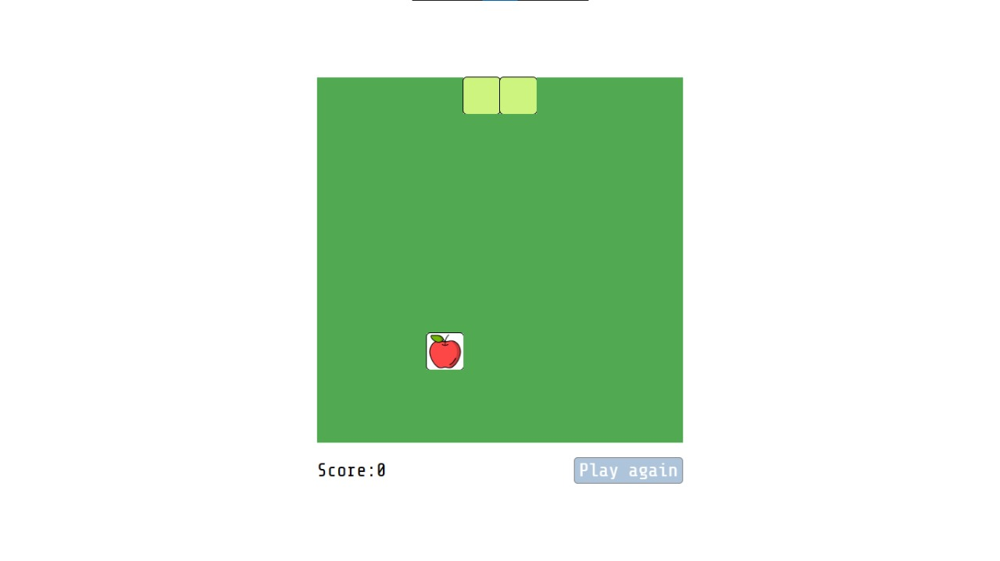
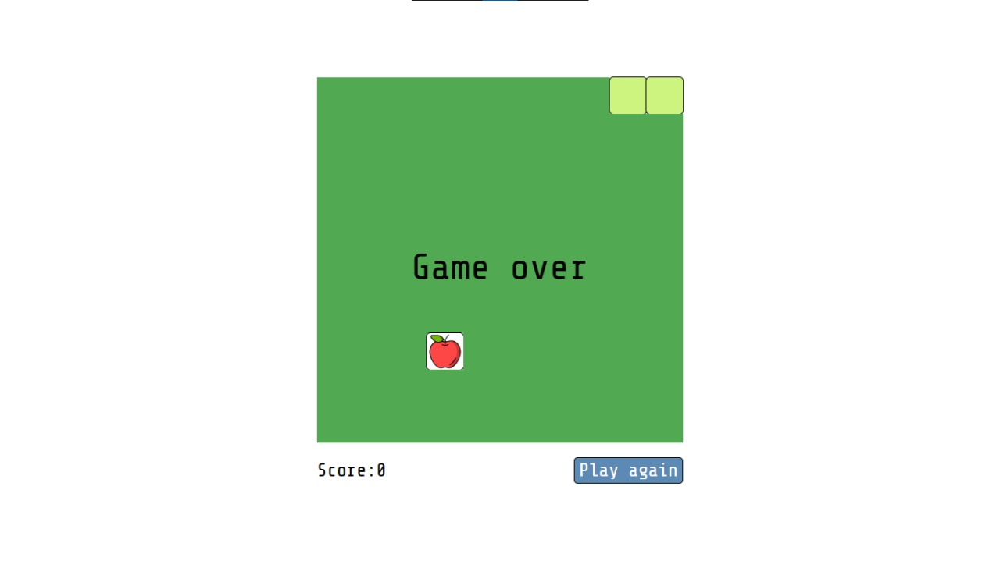
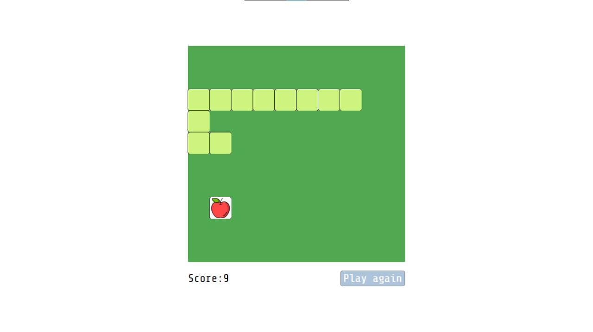

# Snake Game

## Descripción
Snake Game es una versión clásica del popular juego Snake, implementado en Vanilla Javascript. En este juego, controlarás una serpiente que crece cada vez que consume una manzana, mientras evitas colisionar con las paredes y con tu propia cola.

## Características
- Interfaz gráfica simple pero atractiva.
- Control sencillo con las teclas de flecha.
- Sistema de puntuación para seguir tu progreso.

## Capturas de Pantalla

## Instalación
1. Clona este repositorio: `git clone https://github.com/PabloChavez03/snake-game.git`
2. Entra al directorio del proyecto: `cd snake-game`

## Uso
Utiliza alguna extensión para poder levantar el juego en el navegador de tu preferencia. Yo utilizo [Live Server](https://marketplace.visualstudio.com/items?itemName=ritwickdey.LiveServer)

